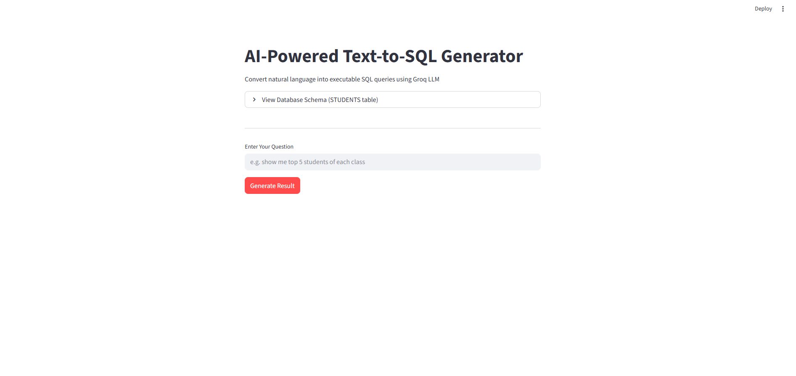
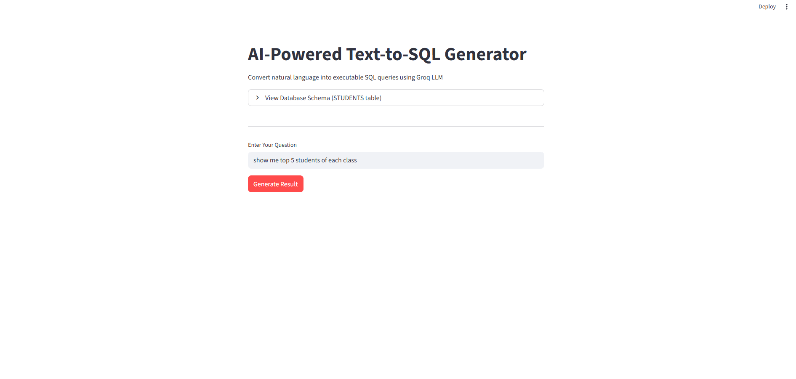
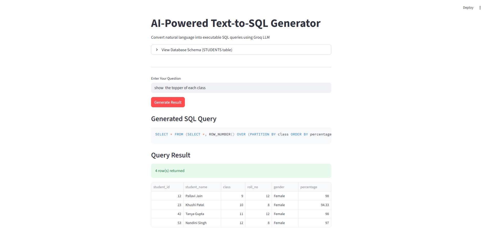

# Natural Language to SQL Query Generator using Groq LLM

An AI-powered web application that converts plain English questions into executable SQLite SQL queries. Built with Groq LLM (Llama 3.3 70B), Streamlit, and Python.

---

## Screenshots

### Home Page


### Generated SQL Query


### Query Result


---

## What It Does

You type a question in plain English — the app calls the Groq LLM API to generate the correct SQL query, runs it against a local SQLite school database, and displays the results in a clean table.

---

## Tech Stack

| Layer      | Technology                         |
|------------|------------------------------------|
| Frontend   | Streamlit                          |
| AI / LLM   | Groq API (llama-3.3-70b-versatile) |
| Database   | SQLite (school.db)                 |
| Language   | Python 3.10+                       |

---

## Project Structure

```
natural-language-to-sql-generator/
├── app.py               # Main Streamlit application
├── database.py          # Creates and seeds the SQLite database
├── groq_test.py         # Standalone script to test Groq API connection
├── requirements.txt     # Python dependencies
├── school.db            # SQLite database (auto-created by database.py)
├── screenshots/         # App screenshots for README
│   ├── homepage.png
│   ├── query.png
│   └── result.png
├── .env                 # API keys (not committed to Git)
└── .gitignore
```

---

## Database Schema

Table name: `STUDENTS`

| Column        | Type    | Description                  |
|---------------|---------|------------------------------|
| student_id    | INTEGER | Primary key (auto-increment) |
| student_name  | TEXT    | Full name                    |
| class         | INTEGER | Class number (9 to 12)       |
| roll_no       | INTEGER | Roll number within class     |
| gender        | TEXT    | Male or Female               |
| maths_marks   | INTEGER | Marks out of 100             |
| science_marks | INTEGER | Marks out of 100             |
| english_marks | INTEGER | Marks out of 100             |
| percentage    | REAL    | Overall percentage           |
| attendance    | INTEGER | Attendance percentage        |
| result        | TEXT    | Pass or Fail                 |

The database is pre-loaded with 60 student records across classes 9, 10, 11, and 12.

---

## Getting Started

### 1. Clone the repository

```bash
git clone https://github.com/aps-codes/natural-language-to-sql-generator.git
cd natural-language-to-sql-generator
```

### 2. Create a virtual environment

```bash
python -m venv venv

# Windows
venv\Scripts\activate

# macOS / Linux
source venv/bin/activate
```

### 3. Install dependencies

```bash
pip install -r requirements.txt
```

### 4. Set up your Groq API key

Create a `.env` file in the project root:

```
GROQ_API_KEY=your_groq_api_key_here
```

Get a free API key at [console.groq.com](https://console.groq.com).

### 5. Create and seed the database

Run this once before starting the app:

```bash
python database.py
```

### 6. Run the application

```bash
streamlit run app.py
```

The app opens at `http://localhost:8501` in your browser.

---

## Example Questions

| Question                                   | What It Does                              |
|--------------------------------------------|-------------------------------------------|
| Show all students in class 10              | Lists every class 10 student              |
| Show top 5 students by percentage          | Returns highest-scoring 5 students        |
| Show failed students in class 9            | Filters by result = Fail and class = 9    |
| How many female students are in class 12?  | Aggregate count with filter               |
| Show students with attendance below 70     | Filters low-attendance records            |
| What is the average percentage of class 11?| AVG aggregate by class                    |
| Show the topper of each class              | Top scorer per class using window function|

---

## Common Error and Fix

**Error:** `Error: 11 columns passed, passed data had 3 columns`

**Cause:** The code was using a hardcoded list of all 11 column names from the STUDENTS table to build a DataFrame, but the SQL query only selected a subset of columns. Pandas raised a shape mismatch error.

**Fix applied:** Column names are now read dynamically from `cursor.description` after executing the query, so they always match the actual columns returned.

```python
# Wrong
columns = ["student_id", "student_name", "class", ...]
df = pd.DataFrame(rows, columns=columns)

# Correct
col_names = [desc[0] for desc in cursor.description]
df = pd.DataFrame(rows, columns=col_names)
```

---

## Requirements

```
streamlit==1.57.0
groq==1.2.0
python-dotenv==1.2.2
pandas==3.0.2
```

---

## Future Improvements

- Support for MySQL and PostgreSQL connections
- Multi-table joins with a configurable schema
- Query history panel showing previous questions and results
- Downloadable results as CSV
- Schema explorer sidebar

---

## Author

**aps-codes**
GitHub: [github.com/aps-codes](https://github.com/aps-codes)